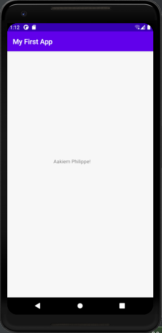

# LIS4381

## Aakiem Philippe

### Assignment 1 Requirements:

*Three Parts:*

1. Distributed version control with Git and Bitbucket
2. Development Installations
3. Questions

#### README.md file should include the following items:

* Screenshot of AMPPS Installation
* Screenshot of running java Hello
* Screenshot of running Android Studio - My First App
* Git Commands w/ Descriptions 
* Bitbucket repo Links - a. This Assignment b. Completed tutorials

### Git commands w/shrt descriptions
1. git init - creates new repository
2. git status - displays the current state
3. git add - adds all modified and new files
4. git commit - individual change to a file
5. git push - used to upload local repo
6. git pull - used to update the local version of a repo
7. git push origin master - push changes from all local branches to matching branches

#### Assignment Screenshots:

*Screenshot of AMPPS running* [My PHP Installation](http://localhost/cgi-bin/phpinfo.cgi "My Php Info")

*Screenshot of running java Hello*:

*Screenshot of Android Studio - My First App*:

#### Tutorial Links:

*Bitbucket Tutorial - Station Locations:*
[A1 Bitbucket Station Locations Tutorial Link](https://bitbucket.org/asp16f/bitbucketstationlocations/ "Bitbucket Station Locations")
