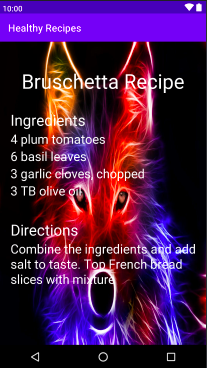
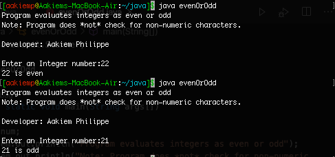
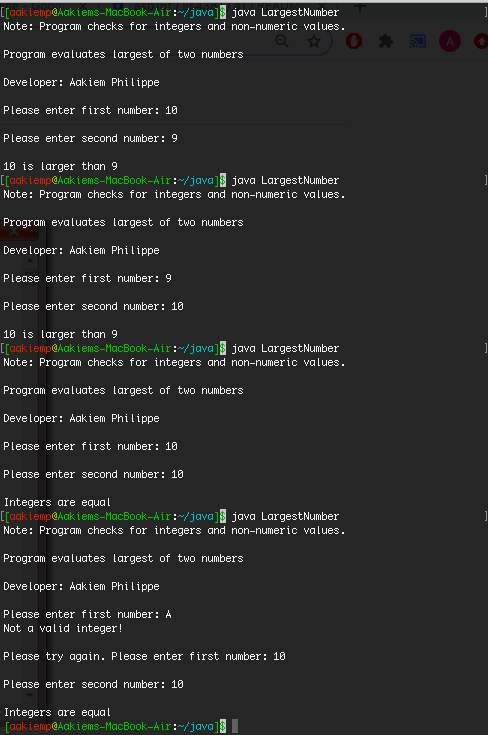
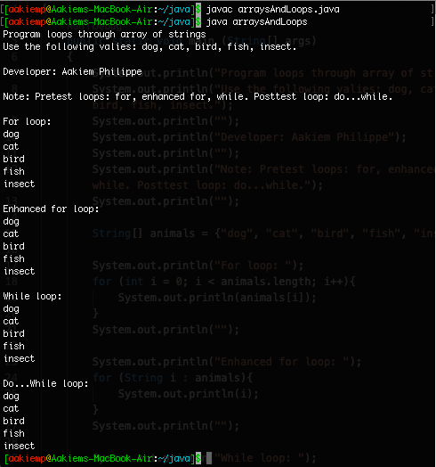

# LIS4381

## Aakiem Philippe

### Assignment 2 Requirements:

*Three Parts:*

1. Develop Healthy Recipies app
2. Change background image on app
3. Java skill sets

#### README.md file should include the following items:

* Screenshot of running application’s first user interface
* Screenshot of running application’s Second user interface
* Screenshots of completed Java skill sets

#### Assignment Screenshots:

| *Screenshot of First Interface:* | *Screenshot of Second Interface:* |
|----------------------------------|------------------------------------|
|  |  |

*Screenshots of Java Skill Sets*

| *Skill Set 1: Even or Odd* | *Skill Set 2: Largest of two integers (With Data validation):* | *Skill Set 3: Arrays and loops*|
|-----------------------------|----------------------------------------|-------------------------------|
|  |  | 

#### Tutorial Links:

*Bitbucket Tutorial - Station Locations:*
[A1 Bitbucket Station Locations Tutorial Link](https://bitbucket.org/asp16f/bitbucketstationlocations/ "Bitbucket Station Locations")
