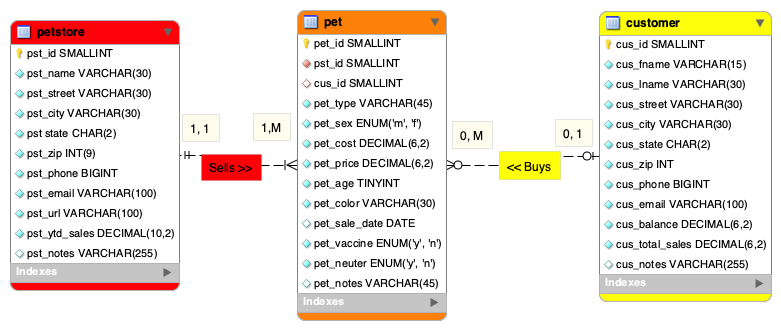
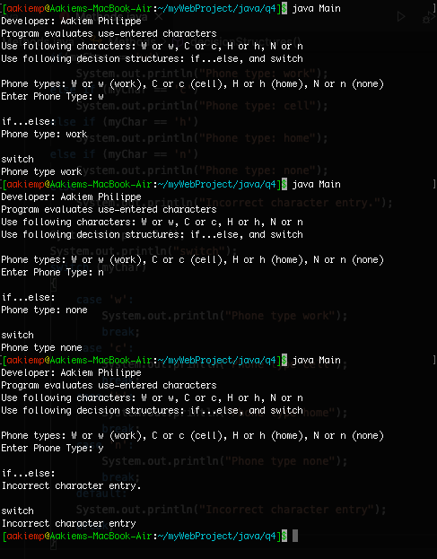
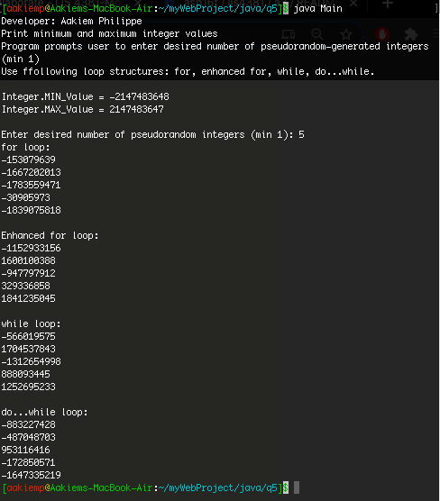
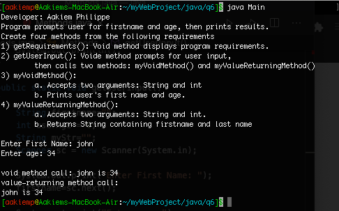

## Aakiem Philippe

### Assignment #3 Requirements:
1. Entity Relationship Diagram (ERD)
2. Create My Event application
3. Java Skill Sets
4. Include links to all of the following files:
    - docs folder: a3.mwb amd a3.sql

#### Assignment Screenshots and links:

*Screenshots of application Interfaces:*

    

*Screenshot of A3 ERD:*

*Screenshot of Java Skillsets*

| *Skill Set 4: Descision Structures* | *Skill Set 5: Random Array* | *Skill Set 6: Methods*|
|-----------------------------|----------------------------------------|-------------------------------|
|  |  | 

*A3 docs: a3.mwb and a3.sql:*

[A3 MWB File](docs/a3.mwb "A3 ERD in .mwb format")

[A3 SQL Script](docs/a3.sql "A3 SQL Script")