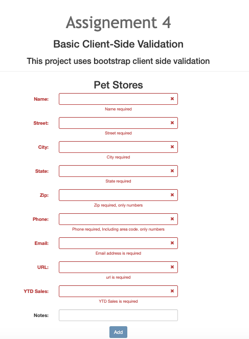
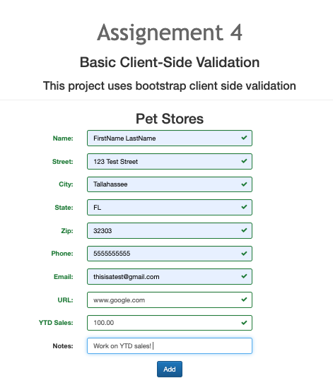
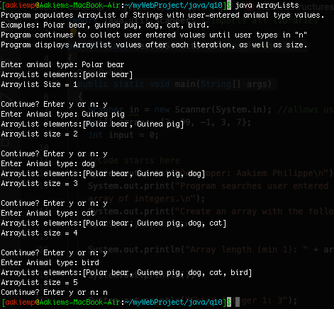
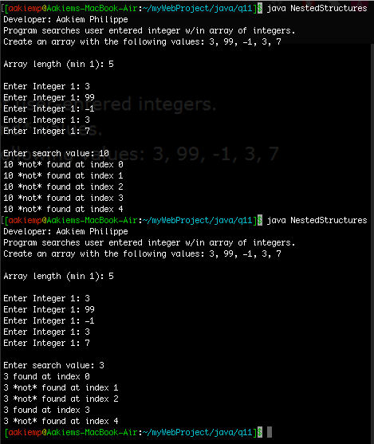
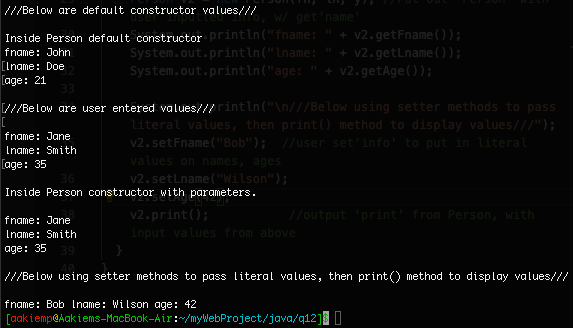

# LIS 4381

## Aakiem Philippe

### Assignment 4 Requirements:

1. Create Bootstrap carousel
2. Create a form to collect data including client-side validation
4. Skill Set 10-12

#### README.md file should include the following items:

* Screenshot of carousel
* Screenshot of Assignment 4 invalid data entry
* Screenshot of Assignment 4 valid data entry
* Java Skillsets

#### Assignment Screenshots:

| *Screenshot of carousel*:                    | *Screenshot of Assignment 4 invalid data entry*:|*Screenshot of Assignment 4 valid data entry*:|
|----------------------------------------------|-------------------------------------------------|----------------------------------------------|
|         |      |   |

#### Skill Sets Screenshots:

| *Screenshot of Skill set Array Lists*:|   *Screenshot of Skill set Nested Structures*:  | *Screenshot of Skill set Person Class*: |
|---------------------------------------|-------------------------------------------------|-----------------------------------------|
|    |  |    |