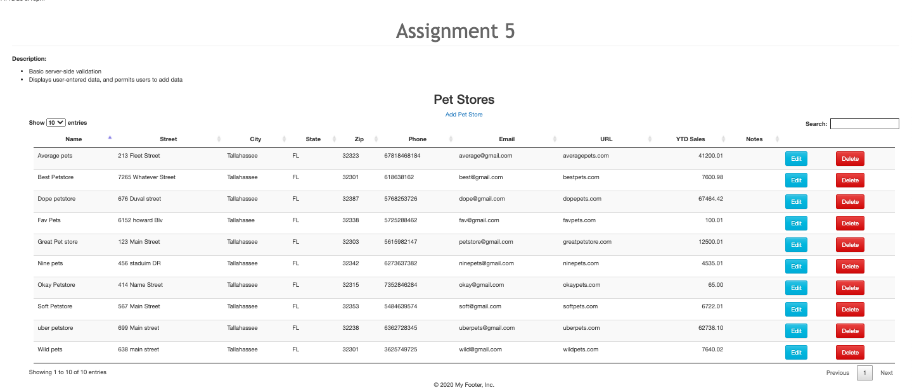
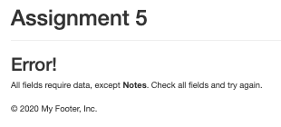
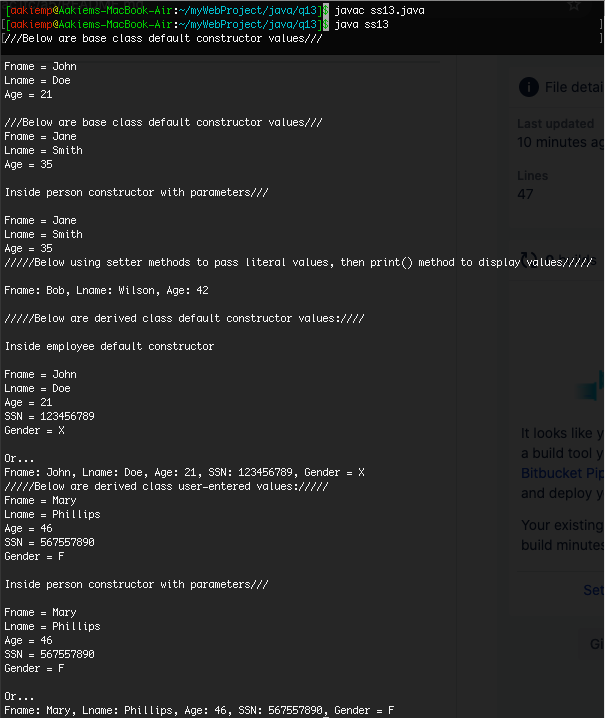
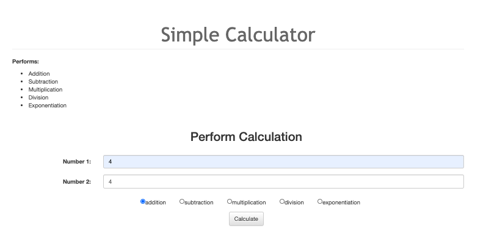
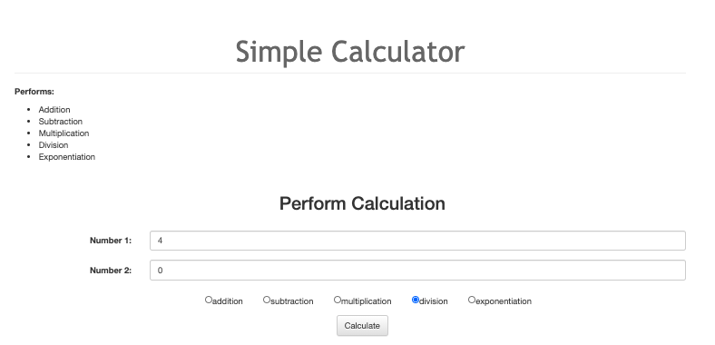
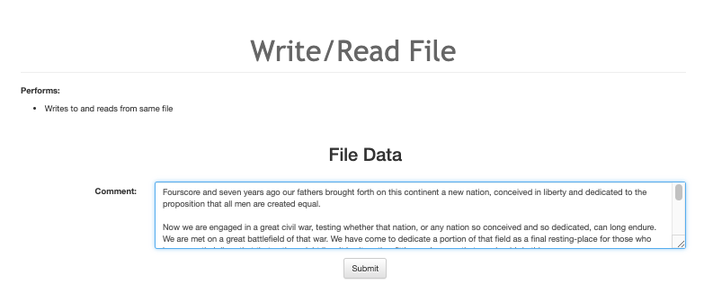

# LIS4381

## Aakiem Philippe

### Assignment 5 Requirements:

*Four-Parts:*

1. Develop server-side validation of a form in php
2. Develop a form that adds data into a database
3. Chapter Questions (chs. 11, 12, & 19)
4. Skill Set 13-15

#### README.md file should include the following items:

* Screenshot of index.php for the data in petstore
* Screenshot of server-side data validation
* Local lis4381 web app: http://localhost/repos/lis4381/

| Index.php |  Error  |
| ------------- | ------------- |
|   |  |

| Employee Inherits Person Class |
| ------------- |
|   |

#### Simple Calculator

| Add | Result |
| ------------- | ------------- |
| |  |

| Division | Result  |
| ------------- | ------------- |
|   |  |

#### Read Write application

| Read  |  Write  |
| ------------- | ------------- |
|   |  |
