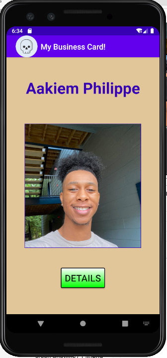
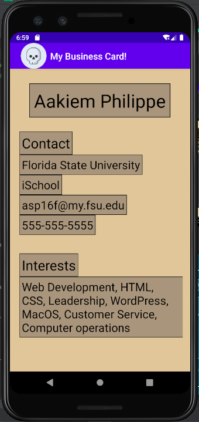
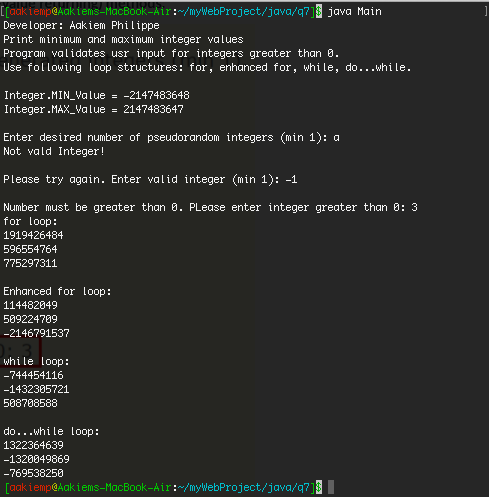
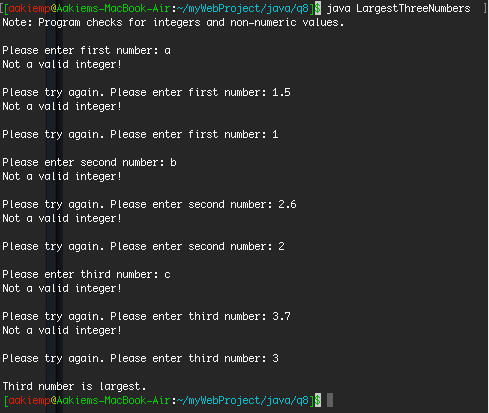
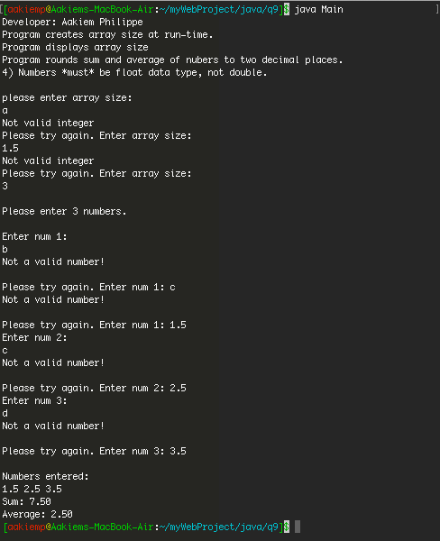

## Aakiem Philippe

### Project 1 Requirements:
1. Java Skillsets
2. Android Business card app

#### Assignment Screenshots and links:

*Screenshots of application Interfaces:*

    

*Screenshot of Java Skillsets*

| *Skill Set 7: Random Array Using Methods and Data Validation* | *Skill Set 8: Largest of Three Integers* | *Skill Set 6: Array_Runtime_Data_Validation*|
|-----------------------------|----------------------------------------|-------------------------------|
|  |  | 

