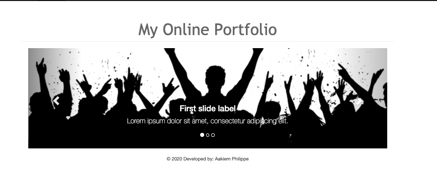
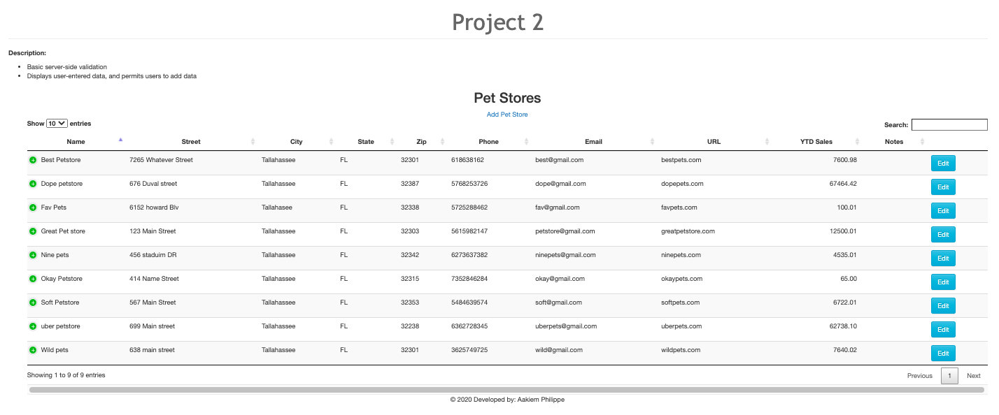
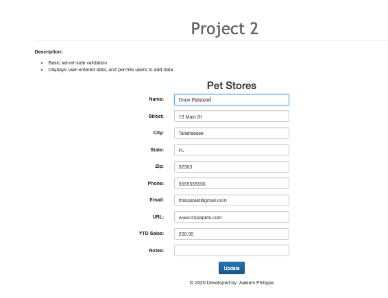
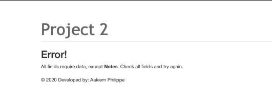
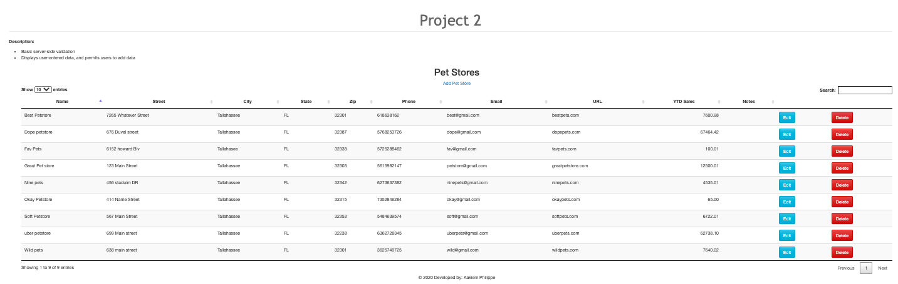
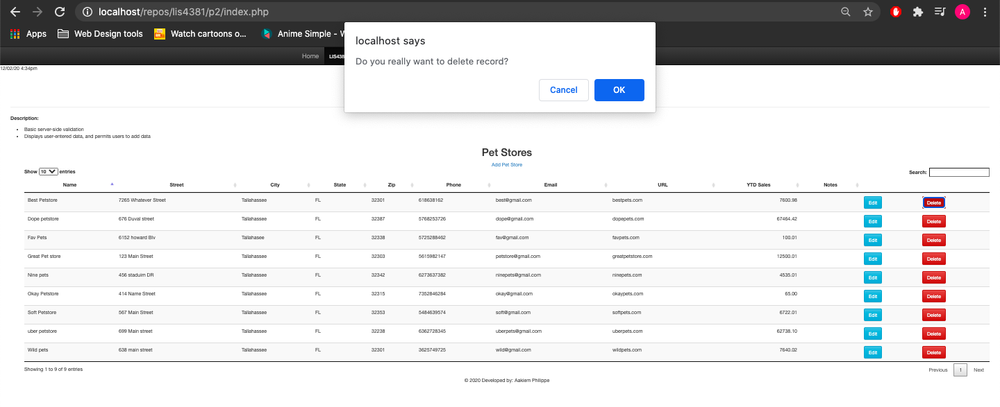
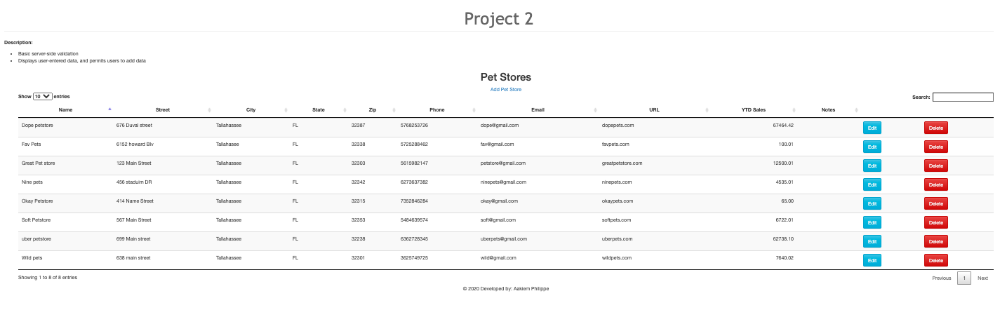
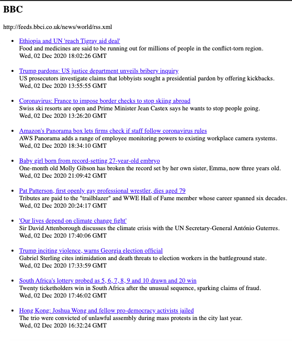

# LIS 4381

## Aakiem Philippe

### Project 2 Requirements:

## Four parts

1. Add edit functionality to the pet store database
2. Add delete functionality to the pet store database
3. Create an RSS feed
4. Chapter Questions (chs.13 & 14)

#### README.md file should include the following items:

* Course title, Your name, Assignment Requirements
* Screenshot of pet store database running on a browser
* Screenshot of editing a record in the pet store database
* Screenshot of the RSS feed

#### Assignment Screenshots:

| *Screenshot of Home page* :                 | *Screenshot of Index* :                                |
|---------------------------------------------|--------------------------------------------------------|
|    |                     |
|---------------------------------------------|--------------------------------------------------------|
| *Screenshot Edit petstore* :                | *Screenshot of Failed Validation* :                    |
|---------------------------------------------|--------------------------------------------------------|
|    |             |
|---------------------------------------------|--------------------------------------------------------|
| *Screenshot Passed Validation* :            | *Screenshot of Delete Records Prompt* :                |
|---------------------------------------------|--------------------------------------------------------|
|  |     |
|---------------------------------------------|--------------------------------------------------------|
| *Screenshot Successfully Deleted Record* :                 | *Screenshot of RSS Feed* :              |
|------------------------------------------------------------|-----------------------------------------|
|  |  |